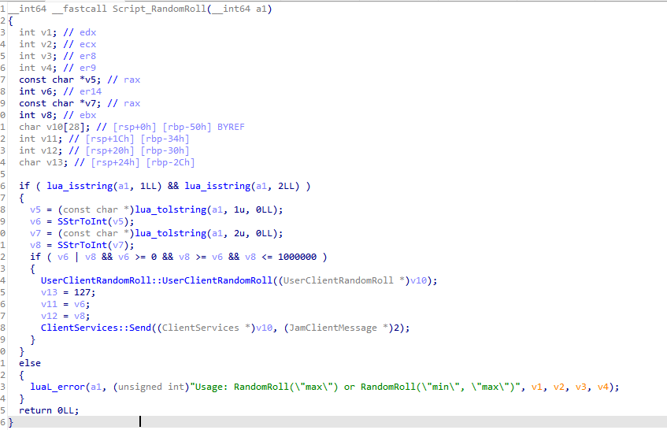
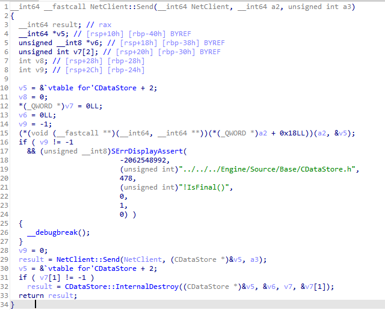

# 🌟 Intro

Hey there! I've been playing World of Warcraft for a few years now, and naturally, curiosity got the best of me. I wanted to peek under the hood and see how everything ticked. That's how this wild project began! Join me on this journey as I share what I've achieved and the fun stuff I've learned along the way.

# 🎯 The Goal

So, what’s the aim of this project? It's all about exploring new systems and methods for reversing binaries while having a laugh at WoW's server anti-cheat logic. My mission? To write up a program that lets me catch and edit WoW packets before they hit the server. 

**P.S.** Just to clarify, this isn’t a how-to guide on hacking or sharing any risky code. Everything here is done on the live version of WoW. Let’s keep it safe and fun!

# 🚀 Starting Out

Armed with a healthy dose of free time (thanks to the oh-so-fun job hunt in the junior dev world), I fired up IDA and took my first shot. Spoiler alert: the fun hit a wall pretty quickly when I realized the WoW binary is super obfuscated. After some digging, I stumbled upon an amazing repo by namreeb—an absolute legend in the WoW reversing scene.

[Check it out here!](https://github.com/namreeb/dumpwow)

Now we had our starting point! But... now what? With a somewhat less obscured IDA dump in hand, I was still scratching my head trying to make sense of it all. I spent a lot of time attempting to reverse various functions, but it got overwhelming fast.

Thankfully, there's a vibrant community around WoW reversing, and some brilliant folks have created full emulations of the WoW server! I managed to snag some older client binaries from before Blizzard cranked up the obfuscation, and they became invaluable for learning the codebase.

Kudos to the talented devs over at TrinityCore—they're amazing and super helpful!

[Take a peek at their repo here!](https://github.com/TrinityCore/TrinityCore)

The TrinityCore repo is going to be a big player in this project moving forward.

# 🕵️‍♂️ Getting into the Weeds

WoW has a built-in LUA space that lets users write their own addons. This is a perfect starting point for me, as it allows me to easily trace the execution down to the network layer (my goal is to manipulate packets). To kick things off, I’m diving into something simple:

`RandomRoll()`

Now if you have never seen an IDA dump before this is pretty much the cleanest they will get without having the actual source code. 

In-game you can input a command in the chat as /roll and the chat will print out a random number between 1-100 (by default).

Under the hood, the client is calling the above screenshot to handle this. I will try keep this as a fairly high level over view but its clear to see that the client is creating a JAM message (Wows serialization system) and then its passing that JAM message over to a curios ClientServies::Send function

Following that Send function we are introduced to another type CDatastore  and yet another NetClient:Send function. From this point we can begin to understand that the JAM system basically wraps this NetClient::Send function and all JAM messages are basically serialized down to a CDatastore struct.  However we don’t want to place our hook here. Simply because in this function a2 is still a JAM message and the actual conversion takes place on line 15 from a JAM to a CDatastore, We don’t want to deal with the JAM client structure so we follow the NetClient:Send function one layer deeper (as you can see the CDatastore is passed into it at v5).

I wont share the NetSend::Send function here simply because it’s a rather big scary function and wouldn’t be explained well enough in one screenshot however, it basically takes the CDatastore and does various packing / encryption to send over the actual network layer. I do not want to deal with any sort of encryption / decryption so we will place our hook at the lowest point I am willing to go NetClient::Send();
